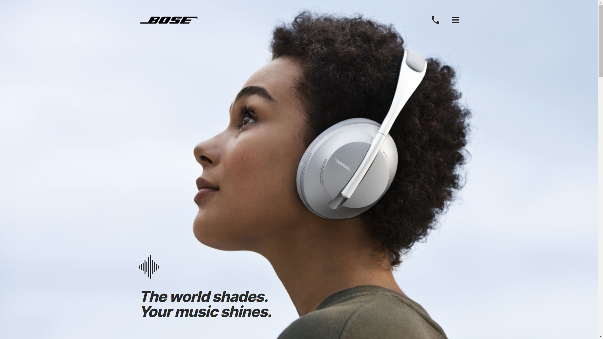

# Bose - landing page

> Simple landing page.
> Live demo [_here_](https://mariuszgit.github.io/layout_bosse/). :muscle:

## General Information
This project is a simple landing page based on a project provided by Mate Academy. The aim of the project is to allow Mate Academy students to practice web development, based on a Figma project.

## Technologies Used
- HTML5 (BEM)
- CSS3 (SASS)
- Figma

## Screenshot

