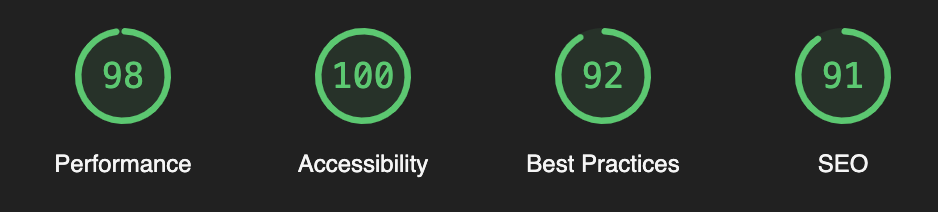

# My Bike landing page

Landing page for a bike store. Presents the main products and services of the store, compares the most popular models of bikes, and provides a form for ordering a bike.

# [DEMO](https://anastasiia-tilikina.github.io/layout_miami/)

# Technologies used

- HTML5
- CSS3
- Sass (SCSS)
- BEM methodology
- JavaScript

# Features Overview

Layout is adaptive and responsive as well as cross-browser compatible. It works correctly on all screen sizes (mobile, tablet and desktop versions). Is is implemented according to the mobile-first approach.

The code is valid HTML5 and CSS3. In order to decrease user load and avoid code duplication, styles are implemented using Sass (SCSS) including advanced features like mixins, extends, conditional operators etc. 
BEM methodology is used for naming classes. This naming convention makes the code more readable and understandable, helps to avoid naming conflicts and makes the code easier to maintain and reuse.

Semantic tags are used. SEO optimization is done. Accessibility is improved.

*see google lighthouse report below*

# Reflections

This project aimed to improve my skills in HTML5, CSS3, Sass (SCSS), BEM methodology, JavaScript, responsive and adaptive layout and build the entire landing page positioning elements using all the tools such as flexbox, grid, media queries, etc.

The main challenge was to combine all the knowledge and skills I have acquired so far and implement a landing page from scratch. I had to use all the tools I have learned up to this point and apply them in practice.
