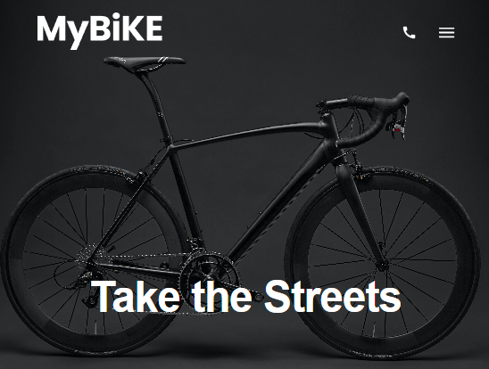

# MyBike Landing Page

A responsive **Landing Page** for a bike store offering the latest bicycles and accessories.

## 📱 Responsiveness

The website was designed to adapt to various screen sizes:

- 📱 Mobile devices: from **320px**
- 📱 Tablets: from **600px**
- 💻 Larger screens: from **1020px**

## 🛠️ Technologies Used

- **HTML5** – page structure
- **CSS / SCSS** – styling and responsiveness
- **npm** – dependency management and project launch

## 🚀 Getting Started

1. Install dependencies:

   ```bash
   npm install

2. Run project:
   ```bash
   npm start

🧩 Features
- Fully responsive layout

- Sections promoting bicycles and accessories

- Simple contact form

- Smooth animations and transitions
